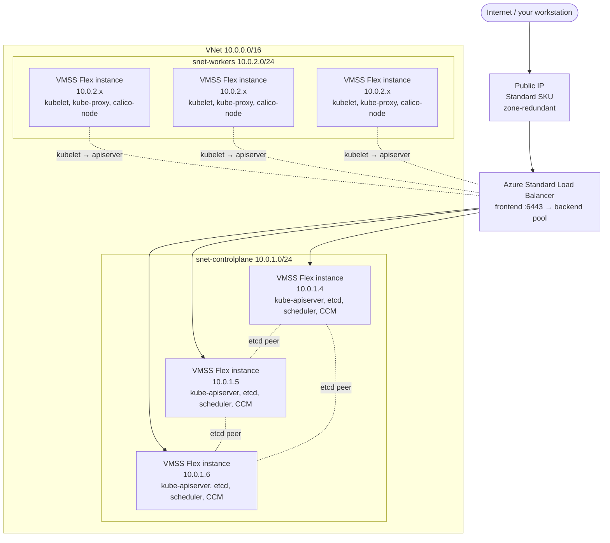

# Architecture: Self-Hosted Kubernetes on Azure VMSS Flex

A 5-minute overview of what gets deployed when you follow this repo's quickstart, and why each piece is there.

## TL;DR

You end up with:

- **1 resource group**
- **1 VNet** (`10.0.0.0/16`), 2 subnets: control-plane `10.0.1.0/24`, workers `10.0.2.0/24`
- **1 NSG** with K8s-specific allow rules, attached to both subnets
- **1 Standard Load Balancer** with a public IP, fronting the kube-apiserver on port 6443
- **1 control-plane VMSS Flex** (3 instances, attached to LB backend pool)
- **1 worker VMSS Flex** (3 instances, not behind any LB)
- **Calico CNI** running in-cluster for pod networking (VXLAN overlay on top of the Azure VNet)

Total cost when running: **~$2/hr** in `northeurope` with `D4s_v5` CPs and `D8s_v5` workers.

## Diagram

## What each piece does

| Resource | Purpose | Why it's there |
|---|---|---|
| **Public IP + Standard LB** | Single stable endpoint for the apiserver, distributes traffic across 3 CP nodes | Customers expect one `kubeconfig` `server:` URL; SLB handles failover when a CP node dies |
| **NSG with 6 rules** | Allow SSH (22), apiserver (6443), etcd peer (2379-2380), kubelet (10250), Calico VXLAN (UDP 4789), NodePorts (30000-32767) | kubeadm + Calico can't form a quorum/forward pod traffic without these |
| **Control-plane VMSS Flex** | Three identical CP nodes running etcd + apiserver + scheduler + controller-manager as static pods (managed by kubeadm) | Flex Mode gives you per-VM lifecycle (each instance has a stable VM resource) while still being one logical resource for management |
| **Worker VMSS Flex** | Three identical worker nodes running kubelet + kube-proxy + Calico data plane | Workers are pets-not-cattle for kubeadm but Flex VMSS still gives you a single resource to scale up/down |
| **Calico (Tigera operator)** | Pod networking + NetworkPolicy enforcement | Out of the box k8s has no pod CIDR routing in Azure VNets; CNI fills that gap. Calico VXLAN works without needing Azure CNI's IP-per-pod reservation. |

## Why this shape and not something else?

**Why 3 control plane nodes, not 1?**
etcd is a Raft consensus system. With 1 node, you have no HA. With 3, you tolerate 1 failure; with 5, you tolerate 2. Three is the standard tradeoff between cost and resilience.

**Why VMSS Flex on the control plane, not standalone VMs?**
The doc title says "K8s on VMSS Flex" — so we use Flex for both pools to demonstrate it works end-to-end. Standalone VMs are fine too. The only difference: with Flex you get predictable tagging, uniform model, and one resource to scale. The downside is instance names are stamped (e.g. `vmss-k8s-controlplane_4fc08081`), not predictable indexes — so any automation needs `az vm list` enumeration rather than assuming `vm-cp-01/02/03`.

**Why public IP on the LB?**
For learning and testing. **In production, use an internal LB** (`--sku Standard --frontend-type private`) and access the apiserver via VPN, ExpressRoute, or a jumpbox. A public apiserver endpoint is an attack surface — restrict the NSG `allow-apiserver` rule to your office/CI source IPs at minimum.

**Why Calico VXLAN, not BGP or Azure CNI?**
- **VXLAN** works on every Azure region without needing UDR or BGP peering — pods get IPs from a CIDR independent of the VNet, and Calico encapsulates pod-to-pod traffic in UDP/4789.
- **BGP** is faster but requires BGP-aware infrastructure (Calico can't peer with Azure's underlay).
- **Azure CNI** assigns VNet IPs directly to pods (no overlay) but eats a lot of VNet address space and needs IP-per-pod NIC reservations. Use it if you need direct Azure routing or AKS-style integration.

**Why no kube-proxy in iptables mode change?**
Default `iptables` mode works fine at this scale. Switch to IPVS only if you've measured rule-table cost at thousands of services.

## What's deliberately NOT included

To keep the quickstart focused, the following are **out of scope** for the base deployment:

- **Persistent storage** (no Azure Disk CSI driver installed; PVCs won't bind by default)
- **Ingress controller** (no NGINX/Contour/Traefik — use NodePort or install your own)
- **External DNS / cert-manager** (manual cert handling only)
- **cloud-controller-manager** (cluster works without it; nodes are tagged manually)
- **Cluster autoscaler** (covered in [configure-cluster-autoscaler.md](../how-to/configure-cluster-autoscaler.md))
- **Monitoring** (no Prometheus/Grafana — install your own or wire to Azure Monitor)
- **Backups** (etcd snapshot strategy is your responsibility)

See the [how-to guides](../how-to/) for adding these.

## Failure modes the architecture survives

| Failure | Behavior |
|---|---|
| 1 CP node fails | etcd retains quorum (2/3), LB removes the dead node, apiserver remains available |
| 2 CP nodes fail | etcd loses quorum — apiserver becomes read-only. Restore from backup. |
| 1 worker fails | Pods rescheduled to remaining workers within ~5 min (kubelet → apiserver heartbeat timeout) |
| Calico pod on a worker fails | calico-node DaemonSet restarts it; pod-to-pod networking on that node briefly degraded |
| LB probe declares all CPs unhealthy | apiserver unreachable from outside the VNet; pods continue running |

## Failure modes the architecture does NOT survive

| Failure | Impact |
|---|---|
| Whole region outage | Cluster down; this is a single-region deployment |
| Subscription quota exhaustion | New nodes can't be added during scale-up |
| Token expiry without renewal | After 24h, new node joins need a fresh `kubeadm token create` |
| Loss of all 3 etcd members | Cluster state lost without a backup |
| Azure Resource Manager throttling | `az vmss scale` calls fail; cluster autoscaler can't add nodes |
