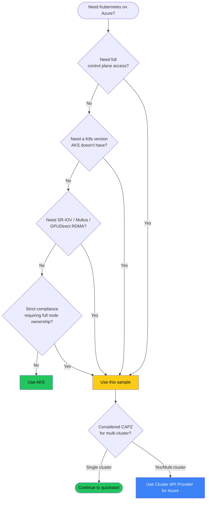

# When to Use Self-Hosted Kubernetes on Azure VMSS Flex

A blunt decision guide. Most teams should use AKS. This sample exists for the cases where AKS doesn't fit.

## TL;DR — use the AKS skip-list

If **none** of the items below describe your situation, **use [AKS](https://learn.microsoft.com/azure/aks/)** and stop reading. AKS handles the control plane for you, ships with cloud-controller-manager, Azure CNI, Azure Disk CSI, autoscaling, and certified upgrades. It removes 80% of the work in this sample.

Reasons to choose self-hosted on VMSS Flex over AKS:

| You need... | AKS limitation | Self-hosted gives you |
|---|---|---|
| **Full control plane access** (etcd flags, custom admission webhooks loaded at apiserver startup, custom audit policy, custom feature gates) | AKS hides the control plane | Direct edit of `/etc/kubernetes/manifests/kube-apiserver.yaml` and etcd |
| **A Kubernetes version AKS hasn't released yet** (or a version AKS has retired) | AKS supports N-2 minor versions | Any kubeadm-supported version |
| **GPUDirect RDMA / InfiniBand fabric** (NDv4/NDv5/H100 cross-VM RDMA) | Partial AKS support; missing some MOFED features | Full control over kernel modules, drivers, ulimits |
| **SR-IOV + Multus CNI** for high-PPS workloads (NFV, real-time media) | Not supported in AKS | Build your own CNI stack |
| **FedRAMP High / DoD IL4-IL5 environments** that require full node ownership | AKS control plane is multi-tenant Azure-managed | You own every binary |
| **A different container runtime** (e.g. CRI-O, sysbox) | AKS only ships containerd | Install anything CRI-compatible |
| **Custom kernel** (real-time, hardened, EROFS rootfs) | AKS uses fixed kernel | Your own image via Image Builder |
| **Air-gapped or sovereign-cloud constraints** with no Azure-managed dependencies allowed | AKS control plane runs in Azure | Cluster is just VMs you own |

If you ticked one of these, this sample is for you.

## When to use AKS instead

You don't need this sample if **any** of these apply:

- You want zero control plane operations. AKS upgrades, patches, and backs up etcd for you.
- You want LoadBalancer Services to "just work." AKS has cloud-controller-manager out of the box.
- You want a PersistentVolumeClaim to bind. AKS has Azure Disk + Azure File CSI drivers preinstalled.
- You want managed cluster autoscaler. AKS has it as a checkbox.
- You want a managed ingress controller. AKS App Routing + Azure Front Door.
- You want VNet integration without thinking about CNI. AKS has Azure CNI + Overlay.
- You want a paved path with Microsoft support included. AKS is supported under your Azure support contract; a self-hosted cluster is YOUR responsibility to keep alive.

The honest reality: **self-hosted on Azure is a 3-5× operational burden over AKS** for the same workload. This sample exists for teams who specifically need that control.

## Tradeoffs you accept by self-hosting

| Area | Self-hosted cost |
|---|---|
| **etcd backups** | You write the cron. AKS does it for you. |
| **Control plane upgrades** | Sequential `kubeadm upgrade` on each CP; you choreograph it. AKS clicks one button. |
| **Cert rotation** | kubeadm rotates control-plane certs at upgrade time. Kubelet certs need `--rotate-certificates`. You verify. |
| **kube-apiserver HA** | You sized the LB, you sized the CPs. AKS sizes for you. |
| **Cluster autoscaler** | You install it, configure RBAC + managed identity, monitor it. AKS toggles it. |
| **CCM-dependent features** (LoadBalancer Services, Azure Disk dynamic provisioning, cloud-aware node deletion) | Install [cloud-provider-azure](https://github.com/kubernetes-sigs/cloud-provider-azure) yourself. AKS bundles it. |
| **Audit logging** | You configure `audit-policy.yaml` and ship logs. AKS ships them to Log Analytics. |
| **Security patching** | Your image; your responsibility. AKS auto-updates monthly. |
| **Compliance attestations** | You attest your stack. AKS comes pre-attested for many frameworks. |

## "But I want AKS-style with more control" — alternatives to consider

Before reaching for full self-hosted:

- **AKS with a custom OS** ([Mariner / Azure Linux](https://learn.microsoft.com/azure/aks/use-azure-linux)) — different OS, AKS-managed cluster
- **AKS with a custom kubelet image** (limited preview) — kernel and kubelet customization on managed CP
- **AKS [Edge Essentials](https://learn.microsoft.com/azure/aks/hybrid/aks-edge-overview)** — for air-gapped on-prem
- **[Azure Kubernetes Fleet Manager](https://learn.microsoft.com/azure/kubernetes-fleet/)** — multi-cluster AKS at scale
- **[Cluster API Provider for Azure (CAPZ)](https://capz.sigs.k8s.io/)** — declarative Kubernetes-on-Azure with the option of full self-hosting OR managed CP. If you'll have more than 5 clusters, this is the right tool.

If none of those fit either, you're in the right place. Continue to the [quickstart](../quickstart/deploy-kubeadm-vmss.md).

## What this sample is NOT

To set expectations:

- **Not production-grade by default.** The defaults expose a public-IP apiserver and SSH on the worker subnet. Tighten NSG source ranges, use an internal LB, and put SSH behind Azure Bastion before any production use.
- **Not a managed service.** You will need to patch nodes, rotate certs, upgrade kubeadm, monitor etcd, and respond to Spot evictions.
- **Not a reference architecture.** It's a quickstart that demonstrates one working pattern. Real production setups will diverge (image baking, identity federation, mesh, observability stack).
- **Not opinionated about CNI.** We use Calico VXLAN because it works everywhere; you might pick Cilium, Azure CNI Overlay, or Antrea for your reasons.

## Decision flowchart

## See also

- [Architecture overview](architecture.md) — what this sample deploys
- [Networking concepts](networking.md) — the Azure SLB hairpin and other gotchas
- [Scaling and lifecycle](scaling-and-lifecycle.md) — what ongoing operations look like
